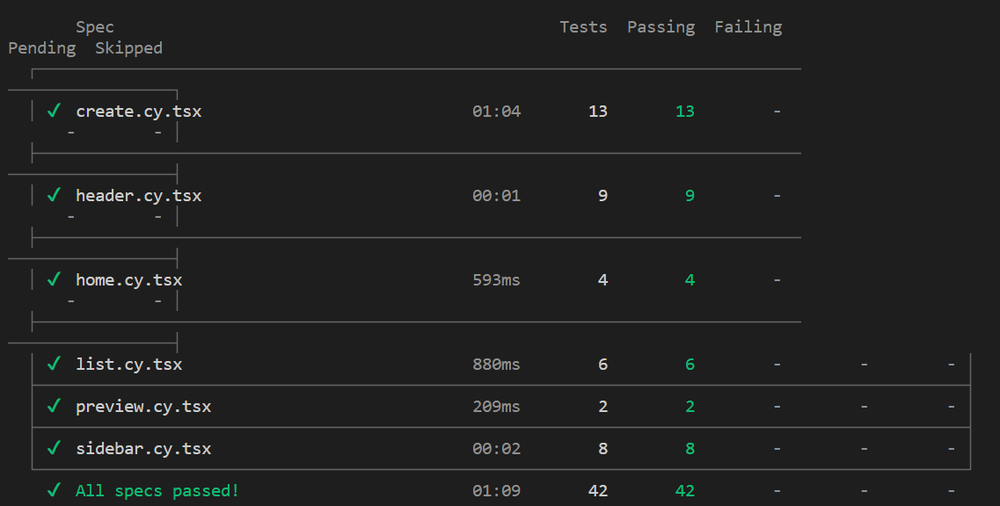

# HAIP

Welcome to HAIP: Your AI Playlist Generator! HAIP is your ultimate music companion. Using the synergy of the APIs of OpenAI and Spotify, HAIP simplifies playlist creation. Describe your desired mood, set the playlist's name and track count, and our AI will craft a personalized playlist for you. If you love a playlist, save it to Spotify with a single click. What's more, you can listen to your playlists directly on the website, enhancing your music experience. And with HAIP, all your created playlists are conveniently stored in one place for easy access. Whether it's a 'Hypnotic Chillout Vibes' playlist or 'High-Energy Workout' mix, HAIP has your music needs covered. Elevate your music enjoyment with HAIP today, where AI meets your unique taste!

## Required installation
- Node (we are using 20.6.0)
- npm
- yarn (only for component tests)
- Add /server/src/.env with PORT, OPEN_API_KEY, CLIENT_ID. 

There are two ways to run the application: locally without Docker and locally with docker-compose. We have also deployed the application, and you can find it here: http://34.16.95.74:3000/

To be able to create a playlist using your Spotify account, you need to be added as a user to our Spotify developer app. Contact us if you want us to add your Spotify account.

## Run locally without docker
1. Inside the server directory:
    - `npm install`
    - `npm start`
2. Inside the client directory:
    - `npm install`
    - `npm start`
3. Setup the database according to below.
4. You find the application here: http://localhost:3000/

### Run tests
1. Component tests
    - Inside the server directory:
        - `npm start`
    - Inside the client directory:
        - `yarn cypress open` (run it interactively in a GUI)
        - `yarn cypress run --component  --headless` (run it in console)
2. Logic tests
    - Inside the client directory:
        - `npm test`

#### Example of test output:
Cypress:


### Setup MySQL database with MYSQL Dashboard

1. Install MySQL workbench, you can follow this guide.
https://www.youtube.com/watch?v=u96rVINbAUI

The MySQL database should have the following properties:
- Host: localhost
- Port: 3306
- Username: root
- Password: databasehaip

In order to create the structure of the database run the following commands in the workbench.

```
CREATE DATABASE haip;
```

```
USE haip;
```

```
CREATE TABLE users (
    USER_ID VARCHAR(255) PRIMARY KEY);
```

```
CREATE TABLE playlists (
    USER_ID VARCHAR(255),
    PLAYLIST_ID VARCHAR(255) PRIMARY KEY,
    FOREIGN KEY (USER_ID) REFERENCES haip.users(USER_ID)
);
```

## Run locally with Docker

1. Start Docker Desktop
2. `docker-compose up`
3. You find the application here: http://localhost:3000/
4. Run jest tests:
    - `docker exec -it CLIENT-CONTAINER-ID npm run test`

### Check if MySQL docker container works:

- `docker exec -it DB-CONTAINER-ID mysql -u root -p`
- `show databases;`
- `use haip;`
- `show tables;`
- `select * from users;`

## Deployment

We have deployed the application using a kubernetes cluster in Google cloud.

We have done the following steps:

1. Download Google Cloud SDK shell
2. In shell: `gcloud auth login`
3. Open Docker Desktop
4. Build Docker images:
    - `docker build -t gcr.io/haip-401908/server .`
    - `docker build -t gcr.io/haip-401908/client .`
    - `docker build -t gcr.io/haip-401908/db .`
5. Push Docker images to Google Container Registry:
    - `docker push gcr.io/haip-401908/server`
    - `docker push gcr.io/haip-401908/client`
    - `docker push gcr.io/haip-401908/db`
6. Configure kubectl to use the manually created cluster:
    - `gcloud container clusters get-credentials haip --zone=us-central1-c`
7. Apply Kubernetes configurations:
    - `kubectl apply -f server-deployment.yaml`
8. Access the app here: http://34.16.95.74:3000/

